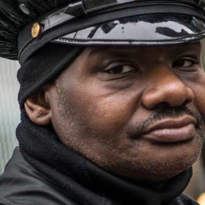
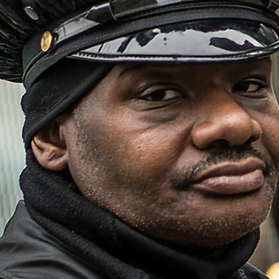

# Super Resolution Analysis

This is a rough copy of code for my master's thesis, provided as is with no guarantee of if it runs in current version. The thesis is provided as a PDF file [here](./Bartosz%20Rajczyk%2C%20Analysis%20of%20Super%20Resolution%20Methods.pdf).

## Results

Here is one example of results from the network, in order:

- High resolution original
- Low Resolution input to the network
- Reconstructed high resolution using network trained with MSE loss
- Reconstructed high resolution using network trained with SSIM loss

 

 

Metrics and additional data can be found in the thesis file.

## Code

There are two files in `code`, one dedicated for preparing data for network training, other for training and evaluating the performance. The training data is (obviously) missing and the network expects there to be several directories to work properly:

- `input/raw` - raw images which are used by `prepare` notebook to generate training data
- `input/high_res` - high res training data will be generated and read from there
- `input/low_res` - low res training data will be generated and read from there

As well as other paths with common dataset data for testing, like:

- `dataset-tests/BSD100`
- `dataset-tests/Set14`
- `dataset-tests/Set5`
